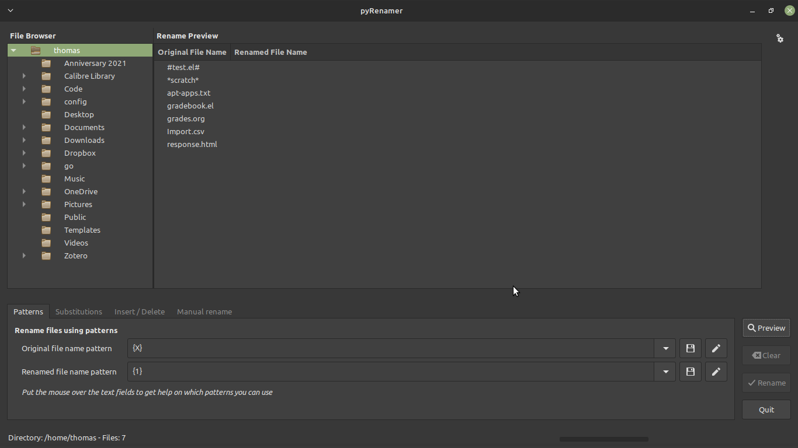

#  pyRenamer

pyRenamer is an application with a graphic interface designed for renaming many files at once. It supports renaming files with patterns, substitutions, inserting text, deleting text, or even manually renaming individual files. 



## Features

Currently, pyRenamer implements the following features:
- Change or keep file extensions when renaming (in options pane)
- Rename files based on patterns in the original file name (e.g. files named 1-a.txt could be changed to a-1.txt using a pattern {#}-{X}.txt)
- Insert characters into a file name
- Delete characters in a file name
- Replace matching characters in a file name
- Replace accented characters with non-accented characters
- Change the capitalization of file names
- Change spaces, dots, and dashes in file names
- Remove duplicated symbols in file names
- Manually rename single files
- Show a preview of the file name changes before renaming the files

## Similar Projects

Note: This project is **not** the same as the following projects:
- pyRenamer: https://github.com/lucasbarzan/py-renamer
- pyrename: https://github.com/sgtpepperpt/pyrename

## Requirements
- python3
- python3-gobject-base

## Install using a conda environment
Conda allows creating a python environment without changing your python system installation and packages. Also, allow distros compatibility since libraries and packages can be named differently across Linux distributions. Also, allows setting the libraries versions to be used with the distributed python software.

Assuming you have installed conda or miniconda python package manager in your system ([if not click here to see how](https://docs.conda.io/en/latest/miniconda.html)]

```
# Clonning the PyRenamer repo
git clone https://github.com/tfree87/pyRenamer
# Enter to the pyRenamer folder
cd pyRenamer
# Create a conda environment with the packages needed by pyRenamer
conda env create -f pyRenamer-environment.yml
# Activate the Conda Python enviroment
conda activate pyRenamer
# Run pyRenamer
python3 pyrenamer/pyrenamer.py
```
## Usage

While pyRenamer is designed to be a graphical program, it can also be called from the command line. Here are the command line options:

```
python3 pyrenamer.py [-h] [-r ROOT_DIR] [-a ACTIVE_DIR]

optional arguments:
  -h, --help            show this help message and exit
  -r ROOT_DIR, --root_dir ROOT_DIR
                        The root directory of the file tree when pyRenamer
                        starts
  -a ACTIVE_DIR, --active_dir ACTIVE_DIR
                        Directory with files to be renamed when pyRenamer
                        starts
```

## About This Repository
pyRenamer has been around for a while and was once a common application in many Linux distributions. A while back, I made this branch as a chance to play around with Python and to update this program that I found so useful. Since then, it appears that much of the pyRenamer code has gone unmaintained so I am making an effort to revive the code and make pyRenamer a useful application once again. I believe pyRenamer still has some value and can be a useful tool for those who want to rename many files and may not be comfortable with command line tools.

## Future
The following items are where I plan to improve pyRenamer:

- Remove all deprecated Gtk+ widgets
- Add docstrings to methods using Numpydoc format
- Reimplement the ability to rename music files with metadata
- Reimplement the ability to rename image files with metadata
